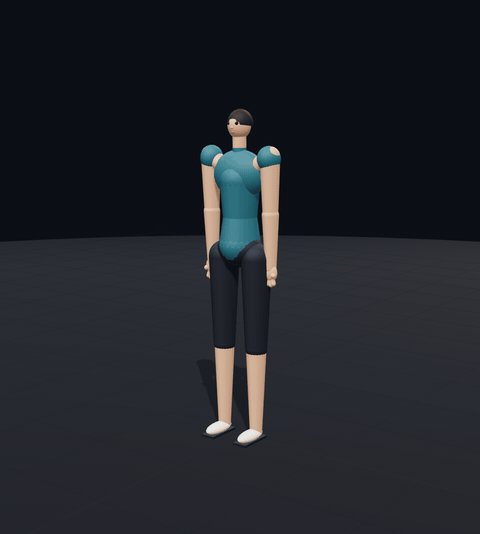

<h1 align="center">Posecode</h1>

<p align="center">
  <b>Kinematic motion as text.</b>
  <br />
  Mermaid gave LLMs a way to draw diagrams.
  <br />
  Posecode gives them a way to show movement.
</p>

<p align="center">
  A human-readable spatial DSL for describing, validating, and rendering
  <br />
  exercises, physiotherapy movements, posture, dance, and human motion.
</p>

<p align="center">
  <a href="https://posecode.org/play"><b>Live Playground</b></a> ·
  <a href="https://posecode.org/moves/">Movement Library</a> ·
  <a href="https://posecode.org/spec.html">Language Specification</a> ·
  <a href="spec/examples">Examples</a> ·
  <a href="packages/posecode-mcp">MCP Server</a>
</p>

<p align="center">
  <a href="https://github.com/posecode-dev/posecode/actions/workflows/ci.yml">
    
  </a>
  <a href="https://www.npmjs.com/package/posecode-parser">
    
  </a>
  <a href="https://github.com/posecode-dev/posecode/blob/main/LICENSE">
    
  </a>
  <a href="https://github.com/posecode-dev/posecode/tree/main/packages/posecode-mcp">
    
  </a>
</p>

> **OpenAI Build Week 2026:** Posecode existed before the hackathon. During Build Week, the project is being meaningfully extended with a GPT-5.6-powered biomechanical Physics Critic and an end-to-end Codex-built agent workflow. The sections below clearly distinguish previous work from new hackathon work.

<p align="center">
  
</p>

<p align="center">
  <sub>
    One <code>.posecode</code> document —
    <code>shoulders: abduct 160</code>,
    <code>hips: abduct 30</code>,
    <code>repeat 12</code> —
    rendered live in the browser.
  </sub>
</p>

<table align="center">
  <tr>
    <td align="center">
      
      <br />
      <sub><code>pelvis: hinge</code> — deadlift</sub>
    </td>
    <td align="center">
      
      <br />
      <sub><code>knees: flex 95</code> — squat</sub>
    </td>
    <td align="center">
      
      <br />
      <sub><code>shoulders: abduct 90</code> — lateral raise</sub>
    </td>
  </tr>
</table>

---

## OpenAI Build Week Extension

### What existed before July 13, 2026

Before OpenAI Build Week, Posecode already included:

- the core `.posecode` domain-specific language,
- a parser and intermediate motion representation,
- basic range-of-motion validation,
- a Three.js/WebGL renderer,
- forward kinematics,
- basic inverse-kinematics and ground-lock behavior,
- a browser playground,
- example movement files,
- shareable Posecode links,
- and an MCP server foundation.

This original version was developed primarily with **Claude** as an AI-assisted engineering tool.

That prior work provides the foundation for the project, but it is not presented as the new hackathon contribution.

### What is being added during Build Week

During the July 13–21 Build Week submission period, Posecode is being meaningfully extended with:

1. **GPT-5.6 Physics Critic**
2. **Biomechanical fidelity scorecard**
3. **Natural-language-to-motion agent workflow**
4. **Interactive generation and critique experience**
5. **Codex-built tests, tooling, and renderer improvements**

The new workflow allows a user to describe a movement in ordinary language, generate structured Posecode, validate it deterministically, and receive a detailed GPT-5.6 critique explaining biomechanical or spatial problems.

### Build Week feature status

- [ ] GPT-5.6 movement generation
- [ ] GPT-5.6 Physics Critic
- [ ] Structured fidelity-score response
- [ ] Critique panel in the playground
- [ ] Generate → validate → critique → revise loop
- [ ] MCP tools for critique and revision
- [ ] Automated tests for the new workflow
- [ ] Demo-ready example movements
- [ ] Build Week commit links added below
- [ ] Codex session ID added below

---

## Why Posecode?

Ask an LLM to explain physical movement and it usually returns unstructured prose or a static diagram.

For example:

> Bend your knees, move your hips backward, and keep your chest upright.

A human may understand that instruction, but a renderer cannot reliably determine:

- which joints should move,
- by how many degrees,
- in which coordinate frame,
- over what duration,
- in what sequence,
- or within which physical limits.

Large language models can often reason about the components of human movement, but they lack a standardized syntax for expressing that reasoning in a renderable and testable form.

Posecode provides that missing representation.

---

## Why Not Diffusion Text-to-Motion?

Neural text-to-motion systems can generate impressive movement, but they introduce problems for lightweight, programmable applications.

### Resource intensive

Many systems require large models and GPU-backed inference, making real-time consumer deployment expensive.

### Difficult to control

They usually produce coordinate trajectories rather than editable semantic instructions.

It is difficult to request a precise change such as:

> Reduce knee flexion by 10 degrees during the second phase.

### Hard to validate

Black-box trajectories do not naturally expose readable joint rules, phase definitions, or range-of-motion limits.

### Hard to debug

When a movement looks wrong, developers may not know which semantic instruction caused the problem.

---

## The Posecode Approach

Posecode uses a lightweight, text-driven pipeline.

- **Readable:** movements are stored as small `.posecode` documents.
- **Structured:** joints, actions, angles, timings, and constraints are explicit.
- **Editable:** developers and models can modify individual movement properties.
- **Fast:** parsing and rendering happen client-side.
- **Deterministic:** the same Posecode input produces the same validated representation.
- **Inspectable:** parser warnings and fidelity checks explain problems.
- **Agent-friendly:** the MCP server exposes generation, validation, critique, and sharing tools.
- **Safety-aware:** authored and IK-generated angles are constrained by configured range-of-motion limits.

---

## The Idea in 30 Seconds

A `.posecode` file describes movement as timed phases with targeted joint actions.

| 1. Write `.posecode` | 2. Render the movement |
| :--- | :--- |
| **`posecode`** `exercise "Body-weight squat"`<br />**`rig`** `humanoid`<br />**`pose`** `start = standing`<br /><br />**`step`** `"Descend" 1.6s ease-in-out`:<br />&nbsp;&nbsp;`hips: flex 80`<br />&nbsp;&nbsp;`knees: flex 95`<br />&nbsp;&nbsp;`ankles: dorsiflex 14`<br />&nbsp;&nbsp;`ground-lock: feet`<br />&nbsp;&nbsp;`cue "Sit the hips back"`<br /><br />**`step`** `"Drive up" 1.2s ease-out`:<br />&nbsp;&nbsp;`hips: flex 0`<br />&nbsp;&nbsp;`knees: flex 0`<br />&nbsp;&nbsp;`ankles: dorsiflex 0`<br />&nbsp;&nbsp;`ground-lock: feet`<br /><br />**`repeat`** `8` |  |

---

## Architecture

```text
┌─────────────────────────┐
│ Natural-language prompt │
└────────────┬────────────┘
             │
             ▼
┌─────────────────────────┐
│ GPT-5.6 authoring layer │
└────────────┬────────────┘
             │
             ▼
┌─────────────────────────┐
│     .posecode source    │
└────────────┬────────────┘
             │
             ▼
┌─────────────────────────┐
│ Parser and ROM checking │
└────────────┬────────────┘
             │
             ▼
┌─────────────────────────┐
│ Kinematics and IK layer │
└────────────┬────────────┘
             │
             ├─────────────────────┐
             ▼                     ▼
┌─────────────────────────┐  ┌──────────────────────┐
│ Three.js/WebGL renderer │  │ Fidelity measurements│
└─────────────────────────┘  └──────────┬───────────┘
                                        │
                                        ▼
                             ┌──────────────────────┐
                             │ GPT-5.6 Physics     │
                             │ Critic and revision │
                             └──────────────────────┘
```

---

## Installation and Usage

### Live Playground

Preview, edit, and share movements without installing anything:

**https://posecode.org/play**

---

### Local Development

Requirements:

- Node.js 20 or newer
- npm

Clone the repository:

```bash
git clone https://github.com/posecode-dev/posecode.git
cd posecode
```

Install dependencies:

```bash
npm install
```

Start the playground:

```bash
npm run dev
```

Run tests:

```bash
npm test
```

Run type checking:

```bash
npm run typecheck
```

Run fidelity evaluations:

```bash
npm run eval
```

Build the playground:

```bash
npm run build
```

---

## GPT-5.6 Configuration

> Update these instructions to match the final implementation.

Create an environment file:

```bash
cp .env.example .env
```

Add your OpenAI API key:

```env
OPENAI_API_KEY=your_api_key_here
```

Optionally configure the model:

```env
OPENAI_MODEL=gpt-5.6
```

Start the application:

```bash
npm run dev
```

Never commit API keys to the repository.

---

## MCP Server

Posecode includes a Model Context Protocol server for AI agents.

Run it with:

```bash
npx posecode-mcp
```

Example MCP client configuration:

```json
{
  "mcpServers": {
    "posecode": {
      "command": "npx",
      "args": ["-y", "posecode-mcp"]
    }
  }
}
```

Depending on the final Build Week implementation, the MCP server can expose tools such as:

- `validate_posecode`
- `render_posecode`
- `share_posecode`
- `generate_posecode`
- `critique_posecode`
- `revise_posecode`

> Only list tools that are actually implemented before submitting.

See [`packages/posecode-mcp`](packages/posecode-mcp) for the complete configuration and tool documentation.

---

## Web Component Embed

Embed a Posecode player on a page:

```html
<script src="https://unpkg.com/posecode-embed/dist/posecode-embed.js"></script>

<posecode-player src="/movements/squat.posecode"></posecode-player>
```

The player can be used in:

- documentation,
- educational content,
- exercise guides,
- blog posts,
- and movement libraries.

---

## Core Libraries

Install the parser:

```bash
npm install posecode-parser
```

Install the renderer:

```bash
npm install posecode-render
```

Example:

```ts
import { parsePosecode } from "posecode-parser";
import { PosecodeRenderer } from "posecode-render";

const source = `
exercise "Lateral raise"
rig humanoid
pose start = standing

step "Raise" 1.4s ease-in-out:
  shoulders: abduct 90
`;

const result = parsePosecode(source);

if (!result.ok) {
  console.error(result.errors);
} else {
  const renderer = new PosecodeRenderer({
    container: document.querySelector("#viewer"),
  });

  renderer.load(result.document);
  renderer.play();
}
```

> Adjust this example to match the current exported APIs before submission.

---

## How Posecode Stays Honest

Posecode uses multiple layers of checking.

### 1. Range-of-motion clamping

Joint angles are constrained before rendering.

For example:

```posecode
knees: flex 200
```

is clamped to the configured knee-flexion limit and produces a warning instead of rendering an impossible angle.

### 2. Kinematic evaluation

The engine measures the actual resulting skeleton after:

- parsing,
- forward kinematics,
- inverse kinematics,
- and ground-lock corrections.

### 3. Geometric fidelity invariants

Movement examples can define expected properties.

For example, a deadlift may require:

- sufficient torso pitch,
- limited forward knee travel,
- stable foot contact,
- and symmetrical hip movement.

### 4. GPT-5.6 Physics Critic

The Build Week critic interprets the movement and deterministic measurements together.

It explains biomechanical problems in natural language and proposes specific revisions.

---

## Packages

| Package | Purpose |
| --- | --- |
| [`posecode-language`](packages/posecode-language) | Language definitions and editor support |
| [`posecode-parser`](packages/posecode-parser) | Converts `.posecode` text into validated, ROM-constrained intermediate representation |
| [`posecode-render`](packages/posecode-render) | Renders animated figures with Three.js, forward kinematics, and IK |
| [`posecode-share`](packages/posecode-share) | Encodes Posecode documents into URL-safe share tokens |
| [`posecode-mcp`](packages/posecode-mcp) | Exposes Posecode capabilities to AI agents through MCP |
| [`posecode-eval`](packages/posecode-eval) | Runs headless biomechanical and geometric fidelity evaluations |
| [`playground`](playground) | Interactive editor, 3D viewport, warnings, generation, critique, and sharing |

---

## Technology

Posecode is built with:

- TypeScript
- JavaScript
- Node.js
- Three.js
- WebGL
- Vite
- CodeMirror
- Model Context Protocol
- Zod
- Vitest
- Playwright
- esbuild
- GPT-5.6
- Codex

---

## Scope

### Version 0.1

Posecode currently focuses on:

- single-person human movement,
- fitness,
- physiotherapy demonstrations,
- posture,
- dance,
- education,
- rehabilitation visualization,
- forward kinematics,
- ground locking,
- ROM-constrained inverse kinematics,
- hip hinging,
- standing, seated, and lying poses,
- basic scene props,
- and browser-based rendering.

### Deferred

The following are outside the current scope:

- two-person or partner motion,
- collision detection,
- detailed object physics,
- advanced equipment simulation,
- multi-joint finger animation,
- FBX or GLB animation export,
- and medical diagnosis.

---

## Limitations and Safety

Posecode is an engineering and visualization project.

Its range-of-motion values and biomechanical checks are based on general reference data and simplified models.

They are not:

- medical advice,
- diagnosis,
- injury-prevention guarantees,
- physiotherapy prescriptions,
- or a substitute for a qualified professional.

Generated movements should be reviewed by a qualified expert before being used for healthcare, rehabilitation, or safety-critical applications.

---

## Potential Applications

Posecode could support:

- game and character animation,
- fitness instruction,
- exercise visualization,
- anatomy education,
- physiotherapy demonstrations,
- posture training,
- dance and choreography prototyping,
- sports technique analysis,
- robotics research,
- synthetic motion-data generation,
- and embodied AI systems.

---

## Roadmap

- [ ] Complete GPT-5.6 Physics Critic
- [ ] Complete biomechanical fidelity scorecard
- [ ] Add generate → critique → revise agent loop
- [ ] Add critique tools to the MCP server
- [ ] Add playground prompt interface
- [ ] Expand adversarial movement evaluations
- [ ] Improve temporal interpolation
- [ ] Add more skeletal models
- [ ] Support visual Posecode editing
- [ ] Add standard animation export
- [ ] Explore multi-person movement

See [`ROADMAP.md`](ROADMAP.md) for the longer-term plan.

---

## Repository Structure

```text
posecode/
├── packages/
│   ├── posecode-language/
│   ├── posecode-parser/
│   ├── posecode-render/
│   ├── posecode-share/
│   ├── posecode-mcp/
│   └── posecode-eval/
├── playground/
├── editors/
├── spec/
├── docs/
├── scripts/
└── README.md
```

---

## Testing

Run all unit tests:

```bash
npm test
```

Run coverage:

```bash
npm run coverage
```

Run type checking:

```bash
npm run typecheck
```

Run biomechanical evaluations:

```bash
npm run eval
```

The CI workflow verifies that the project:

- builds successfully,
- passes type checking,
- passes unit tests,
- and satisfies configured movement invariants.

---

## Background

Posecode follows the design study:

> *Kinematic Motion Definition Protocols for Large Language Models*

The project explores whether semantic, text-based movement programs can provide a controllable and inspectable alternative to black-box motion generation.

The specification covers:

- DSL design,
- biomechanical constraints,
- client-side rendering,
- agent integration,
- and possible product applications.

See:

- [`spec/SPEC.md`](spec/SPEC.md)
- [`spec/llm-authoring.md`](spec/llm-authoring.md)
- [`docs/market-research.md`](docs/market-research.md)

---

## Character Asset

The 3D figure uses an Adobe Mixamo anatomical mannequin exported under the applicable Mixamo terms.

The renderer also includes a zero-asset procedural fallback and can accept compatible Mixamo-rigged GLB characters through `characterUrl`.

---

## License

Posecode's open-core packages and protocol are available under the [MIT License](LICENSE).

Review the licenses and terms of any bundled or externally loaded character assets separately.

---

## Feedback and Support

Feedback and contributions are welcome.

- Email: [hello@posecode.org](mailto:hello@posecode.org?subject=Posecode%20Feedback)
- Issues: [GitHub Issues](https://github.com/posecode-dev/posecode/issues)

---


---

## The Build Week Feature: Physics Critic

A movement can be syntactically valid while still being awkward, unstable, unsafe, or physically implausible.

For example:

```posecode
step "Twist" 1s:
  hips: rotate 0
  spine: rotate 90
  feet: lock
```

A parser may understand this program, but the movement may create an unrealistic torso rotation while the hips and feet remain locked.

The new **Physics Critic** sends the structured movement, parser warnings, joint states, and geometric measurements to GPT-5.6.

GPT-5.6 then returns a structured critique such as:

```json
{
  "score": 42,
  "summary": "The movement is syntactically valid but biomechanically implausible.",
  "issues": [
    {
      "severity": "high",
      "category": "spinal_rotation",
      "message": "Torso rotation is excessive while the pelvis and feet remain fixed.",
      "suggestion": "Reduce spinal rotation or allow the pelvis and feet to rotate."
    }
  ]
}
```

The critic does not replace deterministic safety checks. It adds a semantic reasoning layer on top of the real Posecode parser and kinematic engine.

---

## Fidelity Scorecard

The Build Week scorecard combines deterministic measurements with GPT-5.6 analysis.

It can evaluate:

- joint range-of-motion compliance,
- balance and support,
- movement continuity,
- left-right consistency,
- torso and pelvis coordination,
- foot-ground contact,
- reachability,
- abrupt transitions,
- and overall biomechanical plausibility.

Conceptually, the total score is:

$$
F = \sum_{i=1}^{n} w_i s_i
$$

where:

- \(s_i\) is the score for one fidelity dimension,
- \(w_i\) is that dimension's weight,
- and \(\sum_{i=1}^{n} w_i = 1\).

The purpose of the score is not to provide medical advice. It gives developers and AI agents a transparent signal for comparing, debugging, and improving generated movement.

---

## How GPT-5.6 Is Used

GPT-5.6 is used as a spatial and biomechanical reasoning layer.

It supports two Build Week workflows.

### 1. Natural language to Posecode

A user can enter:

> Perform a controlled forward lunge, keep the torso upright, pause at the bottom, and return to standing.

GPT-5.6 translates that request into a structured `.posecode` program with:

- participating joints,
- semantic joint actions,
- approximate angles,
- movement phases,
- timings,
- cues,
- and grounding constraints.

The output is not sent directly to the renderer.

It must pass through the deterministic Posecode pipeline:

```text
Natural-language request
        ↓
GPT-5.6 generation
        ↓
Posecode parser
        ↓
ROM validation
        ↓
Forward and inverse kinematics
        ↓
Geometric fidelity checks
        ↓
WebGL renderer
```

### 2. Physics Critic

After parsing and evaluating the movement, GPT-5.6 receives structured information about:

- the original user request,
- generated Posecode,
- parser warnings,
- clamped joint values,
- movement phases,
- support points,
- kinematic measurements,
- and failed fidelity invariants.

GPT-5.6 uses this information to explain:

- what is wrong,
- why it matters,
- how severe it is,
- and how the movement could be corrected.

This creates an iterative agent loop:

```text
Generate → Parse → Validate → Critique → Revise → Render
```

---

## How Codex Is Used

Codex is the primary engineering tool used for the new Build Week extension.

During the hackathon period, Codex is used to help:

- inspect and understand the existing monorepo,
- design the Physics Critic architecture,
- implement GPT-5.6 API integration,
- define structured generation and critique schemas,
- build new MCP tools,
- create the fidelity-score pipeline,
- add playground UI components,
- implement movement revision workflows,
- debug coordinate and skeletal transformation issues,
- write unit and integration tests,
- create evaluation fixtures,
- improve error handling,
- and document the new system.

Codex accelerates implementation, but the project remains human-directed.

The following decisions are reviewed and selected manually:

- DSL semantics,
- system architecture,
- prompt design,
- scoring dimensions,
- biomechanical constraints,
- validation policy,
- user experience,
- and acceptance or rejection of generated code.

### Codex development workflow

The Build Week workflow follows this process:

1. Define a specific product or engineering problem.
2. Ask Codex to inspect the relevant implementation.
3. Request one or more possible approaches.
4. Review the trade-offs and choose the architecture.
5. Use Codex to implement the selected approach.
6. Run type checking, tests, and fidelity evaluations.
7. Inspect failures manually.
8. Refine the implementation with additional Codex sessions.
9. Review the final changes before committing.

### Codex session


```text
Codex /feedback session ID: TODO
```

---

## Build Week Evidence

The repository history will distinguish pre-existing functionality from work completed during the hackathon.

### Build Week commits

Add the relevant dated commits here:

- [`TODO`](https://github.com/posecode-dev/posecode/commit/TODO) — GPT-5.6 integration
- [`TODO`](https://github.com/posecode-dev/posecode/commit/TODO) — Physics Critic implementation
- [`TODO`](https://github.com/posecode-dev/posecode/commit/TODO) — Fidelity scorecard
- [`TODO`](https://github.com/posecode-dev/posecode/commit/TODO) — Playground generation interface
- [`TODO`](https://github.com/posecode-dev/posecode/commit/TODO) — MCP agent workflow
- [`TODO`](https://github.com/posecode-dev/posecode/commit/TODO) — Tests and documentation

### Build Week comparison

| Before Build Week | Added during Build Week |
| --- | --- |
| Core Posecode DSL | GPT-5.6 natural-language generation |
| Parser and ROM clamping | GPT-5.6 Physics Critic |
| Basic WebGL renderer | Generation and critique interface |
| Existing movement examples | New adversarial fidelity examples |
| MCP server foundation | Generate, critique, and revise MCP tools |
| Deterministic checks | Combined deterministic and semantic scorecard |
| Existing tests | New GPT-5.6 workflow and evaluation tests |

---

---
<p align="center">
  <b>LLMs already have languages for software, data, and interfaces.</b>
  <br />
  <b>Posecode gives them a language for movement.</b>
</p>
