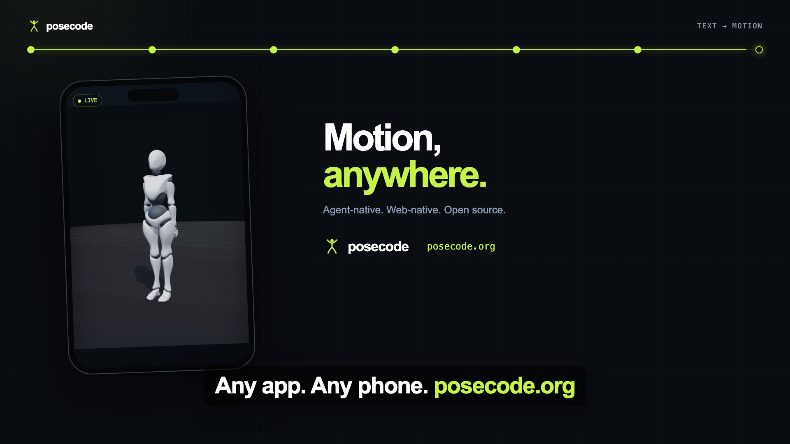

<h1 align="center">Posecode</h1>

<p align="center">
  <b>Kinematic motion as text.</b>
  <br />
  Mermaid gave LLMs a way to draw diagrams.
  <br />
  Posecode gives them a way to show movement.
</p>

<p align="center">
  A human-readable spatial DSL for describing, validating, and rendering
  <br />
  exercises, physiotherapy movements, posture, dance, and human motion.
</p>

<p align="center">
  <a href="https://posecode.org/play"><b>Live Playground</b></a> ·
  <a href="https://posecode.org/moves/">Movement Library</a> ·
  <a href="https://posecode.org/spec.html">Language Specification</a> ·
  <a href="spec/examples">Examples</a> ·
  <a href="packages/posecode-mcp">MCP Server</a>
</p>

<p align="center">
  <a href="https://github.com/posecode-dev/posecode/actions/workflows/ci.yml">
    
  </a>
  <a href="https://www.npmjs.com/package/posecode-parser">
    
  </a>
  <a href="https://github.com/posecode-dev/posecode/blob/main/docs/legal/LICENSING.md">
    
  </a>
  <a href="https://github.com/posecode-dev/posecode/tree/main/packages/posecode-mcp">
    
  </a>
</p>

---

## Why Posecode?

Ask an LLM to explain physical movement and it usually returns unstructured prose or a static diagram.


<p align="center">
  
</p>

<p align="center">
  <sub>
    One <code>.posecode</code> document —
    <code>shoulders: abduct 160</code>,
    <code>hips: abduct 30</code>,
    <code>repeat 12</code> —
    rendered live in the browser.
  </sub>
</p>

For example:

> Bend your knees, move your hips backward, and keep your chest upright.

A human may understand that instruction, but a renderer cannot reliably determine:

- which joints should move,
- by how many degrees,
- in which coordinate frame,
- over what duration,
- in what sequence,
- or within which physical limits.

Large language models can often reason about the components of human movement, but they lack a standardized syntax for expressing that reasoning in a renderable and testable form.

Posecode provides that missing representation.

### See Posecode in 28 seconds

From an LLM prompt to editable Posecode, validated 3D rendering, MCP tools,
and a one-script web embed.

<p align="center">
  <a href="docs/launch-media/posecode-cut2-builder-16x9.mp4">
    
  </a>
</p>

<p align="center">
  <a href="docs/launch-media/posecode-cut2-builder-16x9.mp4"><b>▶ Watch the 28-second builder demo</b></a>
  <br />
  <sub>Plain text in. Smooth, programmable 3D motion out.</sub>
</p>

### Movement examples

<table align="center">
  <tr>
    <td align="center">
      
      <br />
      <sub><code>pelvis: hinge</code> — deadlift</sub>
    </td>
    <td align="center">
      
      <br />
      <sub><code>knees: flex 95</code> — squat</sub>
    </td>
    <td align="center">
      
      <br />
      <sub><code>shoulders: abduct 90</code> — lateral raise</sub>
    </td>
  </tr>
</table>

---

## Why Not Diffusion Text-to-Motion?

Neural text-to-motion systems can generate impressive movement, but they introduce problems for lightweight, programmable applications.

### Resource intensive

Many systems require large models and GPU-backed inference, making real-time consumer deployment expensive.

### Difficult to control

They usually produce coordinate trajectories rather than editable semantic instructions.

It is difficult to request a precise change such as:

> Reduce knee flexion by 10 degrees during the second phase.

### Hard to validate

Black-box trajectories do not naturally expose readable joint rules, phase definitions, or range-of-motion limits.

### Hard to debug

When a movement looks wrong, developers may not know which semantic instruction caused the problem.

---

## The Posecode Approach

Posecode uses a lightweight, text-driven pipeline.

- **Readable:** movements are stored as small `.posecode` documents.
- **Structured:** joints, actions, angles, timings, and constraints are explicit.
- **Editable:** developers and models can modify individual movement properties.
- **Fast:** parsing and rendering happen client-side.
- **Deterministic:** the same Posecode input produces the same validated representation.
- **Inspectable:** parser warnings and fidelity checks explain problems.
- **Agent-friendly:** the MCP server exposes generation, validation, critique, and sharing tools.
- **Safety-aware:** authored and IK-generated angles are constrained by configured range-of-motion limits.

---

## The Idea in 30 Seconds

A `.posecode` file describes movement as timed phases with targeted joint actions.

| 1. Write `.posecode` | 2. Render the movement |
| :--- | :--- |
| **`posecode`** `exercise "Body-weight squat"`<br />**`rig`** `humanoid`<br />**`pose`** `start = standing`<br /><br />**`step`** `"Descend" 1.6s settle`:<br />&nbsp;&nbsp;`hips: flex 80`<br />&nbsp;&nbsp;`knees: flex 95`<br />&nbsp;&nbsp;`ankles: dorsiflex 14`<br />&nbsp;&nbsp;`ground-lock: feet`<br />&nbsp;&nbsp;`cue "Sit the hips back"`<br /><br />**`step`** `"Drive up" 1.2s drive`:<br />&nbsp;&nbsp;`hips: flex 0`<br />&nbsp;&nbsp;`knees: flex 0`<br />&nbsp;&nbsp;`ankles: dorsiflex 0`<br />&nbsp;&nbsp;`ground-lock: feet`<br /><br />**`repeat`** `8` |  |

---


> **OpenAI Build Week 2026:** Posecode existed before the hackathon. During Build Week, the project was extended using **Codex** — running on **GPT-5.6** — as the primary engineering tool for a real batch of shipped work: motion/grounding quality, language contract diagnostics, licensing restructuring, release automation, and product-facing pages. The sections below distinguish previous work from Build Week work using actual commit history, not a roadmap.

---

## OpenAI Build Week Extension

### What existed before Build Week

Before Build Week, Posecode already included:

- the core `.posecode` domain-specific language,
- a parser and intermediate motion representation,
- basic range-of-motion validation,
- a Three.js/WebGL renderer,
- forward kinematics,
- basic inverse-kinematics and ground-lock behavior,
- a browser playground,
- example movement files,
- shareable Posecode links,
- and an MCP server foundation.

This original version was developed primarily with **Claude** as an AI-assisted engineering tool.

That prior work provides the foundation for the project, but it is not presented as the new hackathon contribution.

### What was added during Build Week

Every item below is a merged, dated pull request built with Codex (GPT-5.6) — see [Build Week Evidence](#build-week-evidence) for direct links.

1. **Motion and grounding overhaul** — ROM-constrained reach IK, semantic palm/fist/sole/knee/pelvis contact surfaces, multi-contact refinement, stable support handoffs, and XBot-aware grounding ([#76](https://github.com/posecode-dev/posecode/pull/76)).
2. **Language contract and diagnostics** — Posecode language/IR v0.3 custom start-pose blocks with ROM-checked overrides, live and clip-wide grounding/self-collision diagnostics, and an accessible metric floor guide ([#92](https://github.com/posecode-dev/posecode/pull/92)).
3. **Licensing restructure** — split the monorepo into an Apache-2.0 standard layer (spec, parser, share, language, LSP, VS Code) and an AGPL-3.0 product layer (render, embed, MCP, eval, playground), with a commercial-license path ([#84](https://github.com/posecode-dev/posecode/pull/84)).
4. **Release automation** — Changesets-driven npm publishing via GitHub OIDC, MCP Registry publishing, and CI validation of package versions, entry points, and tarball contents ([#66](https://github.com/posecode-dev/posecode/pull/66)).
5. **Third-party integration readiness** — Posecode 0.2 timing vocabulary (`drive`/`settle`/`flow`/`snap`), a parser validation CLI, and embed compatibility metadata ([#62](https://github.com/posecode-dev/posecode/pull/62)).
6. **Ground-lock correctness** — parser-owned validation for per-side foot/hand/elbow ground locks and back-contact support for supine movements, replacing silent acceptance of invalid contacts ([#61](https://github.com/posecode-dev/posecode/pull/61), [#64](https://github.com/posecode-dev/posecode/pull/64)).
7. **LLM-first landing page and product page** — redesigned the landing page around a prompt → Posecode → live 3D story, and added a `/for-products` page documenting the web component, parser, renderer, and MCP server for integrators ([#82](https://github.com/posecode-dev/posecode/pull/82), [#74](https://github.com/posecode-dev/posecode/pull/74)).
8. **Mobile and search fixes** — mobile toolbar/viewer layout, natural hand orientation, and Google Search indexing corrections ([#78](https://github.com/posecode-dev/posecode/pull/78), [#65](https://github.com/posecode-dev/posecode/pull/65)).

### Build Week feature status

- [x] Motion/grounding quality overhaul shipped ([#76](https://github.com/posecode-dev/posecode/pull/76))
- [x] Language contract + diagnostics shipped ([#92](https://github.com/posecode-dev/posecode/pull/92))
- [x] Licensing restructure shipped ([#84](https://github.com/posecode-dev/posecode/pull/84))
- [x] Release automation shipped ([#66](https://github.com/posecode-dev/posecode/pull/66))
- [x] Ground-lock correctness shipped ([#61](https://github.com/posecode-dev/posecode/pull/61), [#64](https://github.com/posecode-dev/posecode/pull/64))
- [x] Landing/product pages shipped ([#82](https://github.com/posecode-dev/posecode/pull/82), [#74](https://github.com/posecode-dev/posecode/pull/74))

---

## How GPT-5.6 Is Used

During Build Week, Codex sessions ran on **GPT-5.6** (GPT-5.6 Terra), which is the model that powers Codex for this event. GPT-5.6 is the reasoning engine behind every Build Week change listed above: reading the existing monorepo, proposing the ROM-constrained IK and contact-surface design in [#76](https://github.com/posecode-dev/posecode/pull/76), designing the language/IR v0.3 diagnostics in [#92](https://github.com/posecode-dev/posecode/pull/92), and drafting the licensing boundary in [#84](https://github.com/posecode-dev/posecode/pull/84).

A GPT-5.6-powered natural-language-to-Posecode generation feature (describe a movement in plain English, get a validated `.posecode` document back) is a natural next step given the existing [`posecode_authoring_guide` MCP tool](packages/posecode-mcp/README.md), but it is **not yet built** — it is not claimed as shipped functionality here.

---

## How Codex Is Used

Codex is the primary engineering tool used for the Build Week extension.

During the hackathon period, Codex was used to:

- inspect and understand the existing monorepo before each change,
- design and implement the ROM-constrained reach IK and contact-surface system ([#76](https://github.com/posecode-dev/posecode/pull/76)),
- design and implement the language/IR v0.3 diagnostics and floor guide ([#92](https://github.com/posecode-dev/posecode/pull/92)),
- restructure package licensing across the monorepo ([#84](https://github.com/posecode-dev/posecode/pull/84)),
- build the Changesets/OIDC npm and MCP Registry release pipeline ([#66](https://github.com/posecode-dev/posecode/pull/66)),
- fix ground-lock validation and silent-acceptance bugs ([#61](https://github.com/posecode-dev/posecode/pull/61), [#64](https://github.com/posecode-dev/posecode/pull/64)),
- redesign the landing page and add the product integration page ([#82](https://github.com/posecode-dev/posecode/pull/82), [#74](https://github.com/posecode-dev/posecode/pull/74)),
- write unit, integration, and evaluation-harness tests for each change,
- and fix mobile UI and search-indexing regressions.

Codex accelerates implementation, but the project remains human-directed. The following decisions were reviewed and selected manually: DSL semantics, system architecture, licensing boundaries, biomechanical constraints, validation policy, user experience, and acceptance or rejection of generated code.

### Codex development workflow

The Build Week workflow follows this process:

1. Define a specific product or engineering problem.
2. Ask Codex to inspect the relevant implementation.
3. Request one or more possible approaches.
4. Review the trade-offs and choose the architecture.
5. Use Codex to implement the selected approach.
6. Run type checking, tests, and biomechanical evaluations (`npm run eval`).
7. Inspect failures manually.
8. Refine the implementation with additional Codex sessions.
9. Review the final changes before committing.

---

## Build Week Evidence

All Build Week work is public, dated, and directly linked below — no placeholders.

### Build Week pull requests

| PR | Merged | What it did |
| --- | --- | --- |
| [#62](https://github.com/posecode-dev/posecode/pull/62) | 2026-07-15 | Posecode 0.2 timing vocabulary, validation CLI, embed compatibility |
| [#61](https://github.com/posecode-dev/posecode/pull/61) | 2026-07-15 | Per-side ground-lock validation |
| [#65](https://github.com/posecode-dev/posecode/pull/65) | 2026-07-16 | Google Search indexing fix |
| [#66](https://github.com/posecode-dev/posecode/pull/66) | 2026-07-16 | npm + MCP Registry release automation |
| [#64](https://github.com/posecode-dev/posecode/pull/64) | 2026-07-16 | Back ground-lock for supine movements |
| [#74](https://github.com/posecode-dev/posecode/pull/74) | 2026-07-16 | `/for-products` integration page |
| [#76](https://github.com/posecode-dev/posecode/pull/76) | 2026-07-17 | Motion/grounding overhaul: ROM-constrained reach IK, contact surfaces |
| [#78](https://github.com/posecode-dev/posecode/pull/78) | 2026-07-17 | Mobile viewer sizing and natural hand orientation |
| [#82](https://github.com/posecode-dev/posecode/pull/82) | 2026-07-17 | LLM-first landing page redesign |
| [#84](https://github.com/posecode-dev/posecode/pull/84) | 2026-07-17 | Apache-2.0 / AGPL-3.0 licensing restructure |
| [#92](https://github.com/posecode-dev/posecode/pull/92) | 2026-07-19 | Language/IR v0.3, grounding/self-collision diagnostics, floor guide |

### Build Week comparison

| Before Build Week | Added during Build Week |
| --- | --- |
| Core Posecode DSL | Language/IR v0.3 custom start-pose blocks |
| Basic ROM clamping | Grounding, self-collision, and floor-guide diagnostics |
| Working IK/grounding | ROM-constrained reach IK with semantic contact surfaces |
| Single license file | Apache-2.0 / AGPL-3.0 layered licensing with commercial path |
| Manual publishing | Automated npm + MCP Registry release pipeline |
| Editorial landing page | LLM-first landing page + `/for-products` integration page |
| Existing tests | New diagnostics, IK, and licensing regression tests |

---


---

## Architecture

```text
┌─────────────────────────┐
│ Natural-language prompt │
└────────────┬────────────┘
             │
             ▼
┌─────────────────────────┐
│ GPT-5.6 authoring layer │
└────────────┬────────────┘
             │
             ▼
┌─────────────────────────┐
│     .posecode source    │
└────────────┬────────────┘
             │
             ▼
┌─────────────────────────┐
│ Parser and ROM checking │
└────────────┬────────────┘
             │
             ▼
┌─────────────────────────┐
│ Kinematics and IK layer │
└────────────┬────────────┘
             │
             ├─────────────────────┐
             ▼                     ▼
┌─────────────────────────┐  ┌──────────────────────┐
│ Three.js/WebGL renderer │  │ Fidelity measurements│
└─────────────────────────┘  └──────────┬───────────┘
                                        │
                                        ▼
                             ┌──────────────────────┐
                             │ GPT-5.6 Physics     │
                             │ Critic and revision │
                             └──────────────────────┘
```

---

## Installation and Usage

### Live Playground

Preview, edit, and share movements without installing anything:

**https://posecode.org/play**

---

### Local Development

Requirements:

- Node.js 20 or newer
- npm

Clone the repository:

```bash
git clone https://github.com/posecode-dev/posecode.git
cd posecode
```

Install dependencies:

```bash
npm install
```

Start the playground:

```bash
npm run dev
```

Run tests:

```bash
npm test
```

Run type checking:

```bash
npm run typecheck
```

Run fidelity evaluations:

```bash
npm run eval
```

Build the playground:

```bash
npm run build
```

---


## MCP Server

Posecode includes a Model Context Protocol server for AI agents.

Run it with:

```bash
npx -y posecode-mcp@latest
```

Example MCP client configuration:

```json
{
  "mcpServers": {
    "posecode": {
      "command": "npx",
      "args": ["-y", "posecode-mcp@latest"]
    }
  }
}
```

The MCP server exposes:

- `validate_posecode`
- `render_posecode`

See [`packages/posecode-mcp`](packages/posecode-mcp) for the complete configuration and tool documentation.

---

## Web Component Embed

Embed a Posecode player on a page:

```html
<script src="https://unpkg.com/posecode-embed/dist/posecode-embed.js"></script>

<posecode-player src="/movements/squat.posecode"></posecode-player>
```

The player can be used in:

- documentation,
- educational content,
- exercise guides,
- blog posts,
- and movement libraries.

---

## Core Libraries

Install the parser:

```bash
npm install posecode-parser
```

Install the renderer:

```bash
npm install posecode-render
```

Example:

```ts
import { parse } from "posecode-parser";
import { createViewer } from "posecode-render";

const source = `
posecode exercise "Lateral raise"
  rig humanoid
  pose start = standing

  step "Raise" 1.4s settle:
    shoulders: abduct 90
`;

const { ir, errors, warnings } = parse(source);

if (!ir || errors.length > 0) {
  console.error(errors);
} else {
  console.warn(warnings);
  const viewer = createViewer(document.querySelector("#viewer"));
  viewer.load(ir);
  viewer.play();
}
```

The `#viewer` element is an HTML `<canvas>`.

---

## How Posecode Stays Honest

Posecode uses multiple layers of checking.

### 1. Range-of-motion clamping

Joint angles are constrained before rendering.

For example:

```posecode
knees: flex 200
```

is clamped to the configured knee-flexion limit and produces a warning instead of rendering an impossible angle.

### 2. Kinematic evaluation

The engine measures the actual resulting skeleton after:

- parsing,
- forward kinematics,
- inverse kinematics,
- and ground-lock corrections.

### 3. Geometric fidelity invariants

Movement examples can define expected properties.

For example, a deadlift may require:

- sufficient torso pitch,
- limited forward knee travel,
- stable foot contact,
- and symmetrical hip movement.

### 4. GPT-5.6 Physics Critic

The Build Week critic interprets the movement and deterministic measurements together.

It explains biomechanical problems in natural language and proposes specific revisions.

---

## Packages

| Package | Purpose |
| --- | --- |
| [`posecode-language`](packages/posecode-language) | Language definitions and editor support |
| [`posecode-parser`](packages/posecode-parser) | Converts `.posecode` text into a validated, range-constrained intermediate representation |
| [`posecode-render`](packages/posecode-render) | Renders animated figures with Three.js, forward kinematics, and IK |
| [`posecode-share`](packages/posecode-share) | Encodes Posecode documents into URL-safe share tokens |
| [`posecode-mcp`](packages/posecode-mcp) | Exposes Posecode capabilities to AI agents through MCP |
| [`posecode-eval`](packages/posecode-eval) | Runs headless biomechanical and geometric fidelity evaluations |
| [`playground`](playground) | Interactive editor, 3D viewport, warnings, generation, critique, and sharing |

---

## Technology

Posecode is built with:

- TypeScript
- JavaScript
- Node.js
- Three.js
- WebGL
- Vite
- CodeMirror
- Model Context Protocol
- Zod
- Vitest
- Playwright
- esbuild
- GPT-5.6
- Codex

---

## Scope

### Version 0.1

Posecode currently focuses on:

- single-person human movement,
- fitness,
- physiotherapy demonstrations,
- posture,
- dance,
- education,
- rehabilitation visualization,
- forward kinematics,
- ground locking,
- ROM-constrained inverse kinematics,
- hip hinging,
- standing, seated, and lying poses,
- basic scene props,
- and browser-based rendering.

### Deferred

The following are outside the current scope:

- two-person or partner motion,
- comprehensive collision detection and rigid-body dynamics,
- detailed object physics,
- advanced equipment simulation,
- multi-joint finger animation,
- FBX or GLB animation export,
- and medical diagnosis.

---

## Limitations and Safety

Posecode is an engineering and visualization project.

Its range-of-motion values and biomechanical checks are based on general reference data and simplified models.

They are not:

- medical advice,
- diagnosis,
- injury-prevention guarantees,
- physiotherapy prescriptions,
- or a substitute for a qualified professional.

Generated movements should be reviewed by a qualified expert before being used for healthcare, rehabilitation, or safety-critical applications.

---

## Potential Applications

Posecode could support:

- game and character animation,
- fitness instruction,
- exercise visualization,
- anatomy education,
- physiotherapy demonstrations,
- posture training,
- dance and choreography prototyping,
- sports technique analysis,
- robotics research,
- synthetic motion-data generation,
- and embodied AI systems.

---

## Repository Structure

```text
posecode/
├── packages/
│   ├── posecode-language/
│   ├── posecode-parser/
│   ├── posecode-render/
│   ├── posecode-share/
│   ├── posecode-mcp/
│   └── posecode-eval/
├── playground/
├── editors/
├── spec/
├── docs/
├── scripts/
└── README.md
```

---

## Testing

Run all unit tests:

```bash
npm test
```

Run coverage:

```bash
npm run coverage
```

Run type checking:

```bash
npm run typecheck
```

Run biomechanical evaluations:

```bash
npm run eval
```

The CI workflow verifies that the project:

- builds successfully,
- passes type checking,
- passes unit tests,
- and satisfies configured movement invariants.

---

## Background

Posecode follows the design study:

> *Kinematic Motion Definition Protocols for Large Language Models*

The project explores whether semantic, text-based movement programs can provide a controllable and inspectable alternative to black-box motion generation.

The specification covers:

- DSL design,
- biomechanical constraints,
- client-side rendering,
- agent integration,
- and possible product applications.

See:

- [`spec/SPEC.md`](spec/SPEC.md)
- [`spec/llm-authoring.md`](spec/llm-authoring.md)
- [`docs/market-research.md`](docs/market-research.md)

---

## Character assets

The hosted playground currently uses an Adobe Mixamo character and one showcase animation under the applicable Adobe terms. These binary assets are not covered by Posecode's software licenses. See [third-party notices](docs/legal/THIRD_PARTY_NOTICES.md).

The renderer also includes a zero-asset procedural figure and accepts compatible humanoid GLB characters through `characterUrl`.

---

## Licensing

Posecode is open source with a clear standard and product boundary:

| Layer | Components | License |
| --- | --- | --- |
| Open standard | Specification, examples, parser, share codec, language service, LSP, VS Code extension | Apache-2.0 |
| Product layer | Renderer, web embed, MCP server, eval harness, hosted playground | AGPL-3.0-only |

Organizations that need to use an AGPL component in a closed-source product may contact [hello@posecode.org](mailto:hello@posecode.org?subject=Posecode%20commercial%20license) about a separate commercial agreement.

Earlier grants are unchanged. MIT revisions remain MIT, and the 0.2.2 npm packages remain Apache-2.0. See [licensing](docs/legal/LICENSING.md), [commercial licensing](docs/legal/COMMERCIAL-LICENSE.md), and [trademark policy](docs/legal/TRADEMARK.md).

---

## Feedback and Support

Feedback and contributions are welcome.

- Email: [hello@posecode.org](mailto:hello@posecode.org?subject=Posecode%20Feedback)
- Issues: [GitHub Issues](https://github.com/posecode-dev/posecode/issues)

---
<p align="center">
  <b>LLMs already have languages for software, data, and interfaces.</b>
  <br />
  <b>Posecode gives them a language for movement.</b>
</p>
