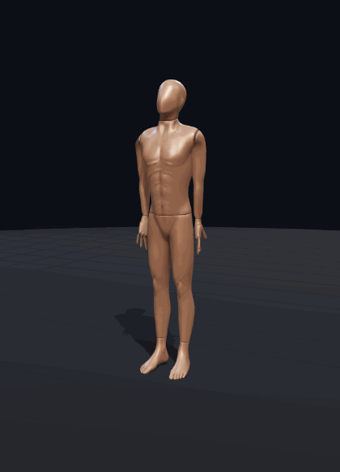
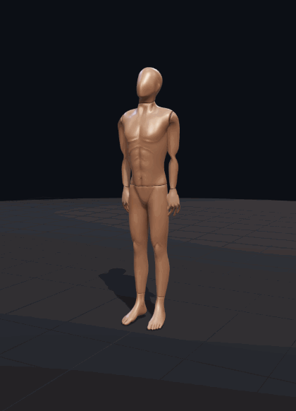
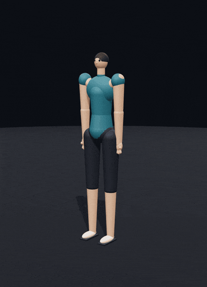

<h1 align="center">Posecode</h1>

<p align="center"><b>Kinematic motion as text.</b> Mermaid gave LLMs a way to draw diagrams.<br/>
Posecode gives them a way to <i>show movement</i>: exercises, physiotherapy, posture,<br/>
as a tiny human-readable language that renders to an animated 3D figure in the browser.</p>

<p align="center">
  <a href="https://posecode.org/play"><b>Live playground</b></a> ·
  <a href="https://posecode.org/moves/">Movement library</a> ·
  <a href="https://posecode.org/spec.html">Language spec</a> ·
  <a href="spec/examples">Examples</a> ·
  <a href="packages/posecode-mcp">MCP server</a>
</p>

<p align="center">
  <a href="https://github.com/posecode-dev/posecode/actions/workflows/ci.yml"></a>
  <a href="https://www.npmjs.com/package/posecode-parser"></a>
  <a href="https://github.com/posecode-dev/posecode/blob/main/LICENSE"></a>
  <a href="https://github.com/posecode-dev/posecode/tree/main/packages/posecode-mcp"></a>
</p>

<table align="center">
  <tr>
    <td align="center"><br/><sub><code>pelvis: hinge</code>, deadlift</sub></td>
    <td align="center"><br/><sub><code>knees: flex 95</code>, squat</sub></td>
    <td align="center"><br/><sub><code>shoulders: abduct 90</code>, lateral raise</sub></td>
  </tr>
</table>

---

## Why Posecode?

Ask an LLM to explain a physical movement, and it will give you unstructured prose or a static, flat diagram. But large language models already *understand* the biomechanics of movement (e.g., "elbows flex, shoulders abduct on the descent of a push-up"). They just lack a standardized syntax to express it in a way that a computer can render dynamically.

### Why not diffusion text-to-motion models?

While neural network-based text-to-motion models exist, they are impractical for consumer web applications:
- **Resource Intensive**: They require heavy, expensive GPU hosting, making real-time generation and scaling cost-prohibitive.
- **No Fine Control**: They output black-box 3D coordinate trajectories, making it impossible to adjust anatomical phases, joint limits, or speed programmatically.
- **Safety Hazards**: There are no safety boundaries, meaning the model can easily render joint extensions that are anatomically impossible or physically dangerous.

### The Posecode Approach

Posecode takes the opposite, lightweight approach:
- **Text-Driven**: The LLM writes a tiny **`.posecode`** text document specifying semantic joint angles and phase times—generation costs a fraction of a cent.
- **Unbelievably Fast**: A client-side parser and WebGL renderer animate the figure at 60 FPS directly in the browser—even on low-end mobile devices.
- **Anatomically Safe**: Every joint rotation is **clamped to clinical range-of-motion limits** from standard physiotherapy tables. Hallucinations like `knee: flex 200` are safely capped with warnings.

---

## The Idea in 30 Seconds

 A `.posecode` file describes human movements as a sequence of timed steps with targeted joint movements and range-of-motion rules:

| 1. Write `.posecode` | 2. Render 3D Animation |
| :--- | :--- |
| **`posecode`** `exercise "Body-weight squat"`<br/>&nbsp;&nbsp;**`rig`** `humanoid`<br/>&nbsp;&nbsp;**`pose`** `start = standing`<br/><br/>&nbsp;&nbsp;**`step`** `"Descend" 1.6s ease-in-out`:<br/>&nbsp;&nbsp;&nbsp;&nbsp;`hips: flex 80`<br/>&nbsp;&nbsp;&nbsp;&nbsp;`knees: flex 95`<br/>&nbsp;&nbsp;&nbsp;&nbsp;`ankles: dorsiflex 14`<br/>&nbsp;&nbsp;&nbsp;&nbsp;`ground-lock: feet`<br/>&nbsp;&nbsp;&nbsp;&nbsp;`cue "Sit the hips back..."`<br/><br/>&nbsp;&nbsp;**`step`** `"Drive up" 1.2s ease-out`:<br/>&nbsp;&nbsp;&nbsp;&nbsp;`hips: flex 0`<br/>&nbsp;&nbsp;&nbsp;&nbsp;`knees: flex 0`<br/>&nbsp;&nbsp;&nbsp;&nbsp;`ankles: dorsiflex 0`<br/>&nbsp;&nbsp;&nbsp;&nbsp;`ground-lock: feet`<br/>&nbsp;&nbsp;&nbsp;&nbsp;`cue "Drive through the heels..."`<br/><br/>&nbsp;&nbsp;**`repeat`** `8` |  |

---

## Installation & Usage

Choose the integration path that fits your use case:

### Live Playground (No installation)
Instantly preview, edit, and share movements in the browser:
**[posecode.org/play](https://posecode.org/play)**

### MCP Server (For AI Agents)
Teach your AI agent (in Claude Desktop, Cursor, etc.) to read, write, and render Posecode natively using our Model Context Protocol server:
```bash
# Add to your MCP client config (e.g. claude_desktop_config.json):
npx posecode-mcp
```
*See the [MCP Package README](packages/posecode-mcp/README.md) for full configuration options.*

### Web Component Embed (For Blogs & Docs)
Embed an interactive, low-poly 3D player on any page using a single `<script>` tag:
```html
<script src="https://unpkg.com/posecode-embed/dist/posecode-embed.js"></script>

<posecode-player src="/movements/squat.posecode"></posecode-player>
```
*See the [Embed Package README](packages/posecode-embed/README.md) for customizing autoplay, controls, speed, and styling.*

### Core Libraries (For custom JS/TS apps)
Build custom rendering or parsing logic directly in your own applications:
```bash
# Parser only (converts text to range-of-motion clamped IR)
npm install posecode-parser

# WebGL 3D Renderer (built on Three.js)
npm install posecode-render
```

---

## How Posecode stays honest

Two safety layers ship with the language:

- **ROM clamping**: every angle is hard-clamped to healthy range-of-motion tables before rendering; a hallucinated `knee: flex 200` renders at its ceiling with a warning, never an impossible joint.
- **Fidelity evals**: [`posecode-eval`](packages/posecode-eval) re-runs the real parser → FK → ground-lock pipeline headlessly and scores geometric invariants ("a deadlift pitches the torso ≥ 50° with vertical shins"). Every example must pass every invariant in CI.

---

## Packages

| Package | What it does |
| --- | --- |
| [`posecode-parser`](packages/posecode-parser) | `.posecode` text → validated, ROM-clamped IR. Pure TypeScript, framework-agnostic. |
| [`posecode-render`](packages/posecode-render) | IR → animated low-poly mannequin (Three.js), forward kinematics + ground-lock CCD IK. |
| [`posecode-share`](packages/posecode-share) | Encode a `.posecode` doc to a URL-safe token so a movement travels as a link. Pure, dependency-free. |
| [`posecode-mcp`](packages/posecode-mcp) | MCP server: lets an LLM agent author, ROM-validate, and get a render link for a movement, natively. |
| [`posecode-eval`](packages/posecode-eval) | Fidelity harness: headless kinematic probing + biomechanical invariant scoring. |
| [`playground`](playground) | Live editor + 3D viewport + warnings + the LLM prompt + shareable links. |

The protocol and both libraries are **MIT-licensed**: the open core. See [`spec/SPEC.md`](spec/SPEC.md) for the full language and [`spec/llm-authoring.md`](spec/llm-authoring.md) for the authoring prompt.
For where Posecode spreads fastest and the per-domain go-to-market plan, see [`docs/market-research.md`](docs/market-research.md); for the engine roadmap, [`ROADMAP.md`](ROADMAP.md).

---

## Scope (v0.1)

Single-person movement across fitness, physio, desk, dance, education & rehab · Mermaid-style DSL · ROM safety clamping (authored **and IK-solved** angles) · forward kinematics · ground-lock **and ROM-constrained reach-to-target IK** · hip-hinge · lying/seated poses · scene props (chair/wall/bar) · a single-DOF hand rig · live playground.

Deferred: two-person / partner movements + collision detection, deeper props (load, bands, rings), multi-joint fingers, FBX/GLB export, hosted SaaS editor and the expert-verified motion marketplace.

---

## Background

This project follows a design study, *"Kinematic Motion Definition Protocols for Large Language Models"*, which argues for a semantic DSL over diffusion models, specifies ROM-based safety constraints from clinical normative data, and lays out the open-core commercialization path. The spec cross-references its sections (§4 DSL, §5 biomechanics, §6 client rendering, §7 strategy).

> Posecode's range-of-motion values are general literature data, not medical advice. Consult a qualified professional for physiotherapy or exercise prescription.

---

## Feedback & Support

We'd love to hear your feedback! You can reach us in two ways:
- **Email**: Send us an email at [hello@posecode.org](mailto:hello@posecode.org?subject=Posecode%20Feedback).
- **GitHub Issues**: If you found a bug or have a feature request, please [open a GitHub Issue](https://github.com/posecode-dev/posecode/issues).
