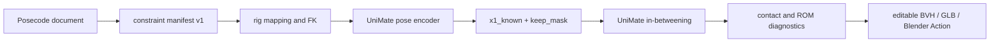

# Posecode × UniMate: sparse key-pose bridge

**Status:** the Posecode manifest producer is merged. The rig-aware adapter is the next joint step and must use UniMate's official unseen-skeleton preprocessing path once it is released.

Posecode should remain the editable source of truth for named phases, sparse key poses, root intent, and contact constraints. UniMate should generate only the motion between those authored anchors. This avoids treating a generated 60 FPS clip as the primary artifact and directly matches UniMate's existing `x1_known` / `keep_mask` replacement path.

## Implemented boundary

`buildUniMateConstraintManifest(ir, { fps: 30 })` now emits a deterministic JSON-safe schedule with:

- one-based contiguous prompt clips compatible with Blender timelines;
- the start pose and every phase endpoint as a named key-pose reference;
- carried local Euler channels, root travel and facing intent;
- phase-range `ground-lock`, `reach`, `pin`, and `grip` constraints;
- display-only cues kept separate from model prompts;
- Posecode-to-Mixamo bone bindings; and
- an explicit mask contract: position and rotation are known at reference frames, velocity remains generative.

The manifest intentionally does **not** claim to be UniMate's normalized `(T, J, 12)` tensor. That final encoding requires the chosen rig's rest hierarchy, global FK positions, and `dataset_stats.npy` from the selected checkpoint. The adapter must compute those values next to UniMate, where that context exists.

For unseen skeletons, the official UniMate preprocessing implementation and unified-normalization checkpoint are the source of truth. The adapter must record the UniMate commit and checkpoint used, and must not duplicate canonicalization, joint pruning, facing selection, or normalization from an inferred contract.

## Smallest useful joint prototype

1. Pin an official UniMate commit that includes unseen-skeleton preprocessing and the matching unified-normalization checkpoint. Until that release exists, keep arbitrary-rig support experimental.
2. Add a manifest importer to [UniMate-B3D](https://github.com/nopeburger/UniMate-B3D).
3. Map each Posecode semantic bone to the selected Blender deform rig, apply every reference pose, then reuse B3D's `encode_pose` path.
4. Build `x1_known` and `keep_mask` with channels `0:9` fixed at reference frames and channels `9:12` left free, matching B3D's current pose-reference behavior.
5. Generate the gaps, then retain Posecode keyframes as hard anchors during retiming.
6. Return an editable Blender Action plus machine-readable diagnostics and preprocessing provenance.

## Evaluation

Use the released 22-joint Mixamo checkpoint first, with 10 to 20 short movements containing two to five key poses. Compare text-only UniMate, Posecode interpolation, and the combined system on:

| Measure | Target |
| --- | --- |
| Authored key-pose rotation error | effectively zero at pinned frames |
| Root endpoint error | under 2 cm |
| Planted-foot drift | under 2 cm during declared contacts |
| ROM violations | none after validation/post-process |
| Animator correction effort | fewer key edits than either baseline |
| Preprocessing parity | preserve the rest body axis with the official text-only baseline |

For arbitrary rigs, run the official preprocessing path before comparing generation methods. `Tiger_rig.glb` from [UniMate issue #8](https://github.com/Friedrich-M/UniMate/issues/8) is a preprocessing-parity fixture: a community converter produced an upright tiger, while the UniMate maintainer reported a correct horizontal result from the same asset. Treat this as a pipeline mismatch to reproduce and eliminate, not as evidence of a model failure.

The remaining model and bridge failure set is deliberately small: rare topologies after official preprocessing, opposing contact constraints, phase references placed too close for a 60-frame generation window, and anchors that preserve pose while producing implausible transitions.

## Contribution split and licensing

- **Posecode:** manifest producer, Mixamo binding profile, fixtures, browser demo, contact/ROM diagnostics, and evaluation report.
- **UniMate / UniMate-B3D:** rig-specific FK and pose encoding, checkpoint normalization, generation, and Blender Action creation.
- **Shared:** benchmark clips, failure taxonomy, and a short technical report if results warrant it.

The new Posecode adapter is part of `posecode-render` and therefore AGPL-3.0-only. UniMate's repository code is MIT; UniMate-B3D is GPL-3.0-or-later. The released UniMate weights are CC BY-NC 4.0, so model-backed commercial use is a separate question from code reuse and must not be represented as MIT-covered.

## Acceptance test

A bridge is complete when four Posecode-authored Mixamo key poses can be imported, used as fixed UniMate references, generated between, and exported as a Blender Action while preserving all four anchors and reporting contact/ROM residuals. An arbitrary-rig result must also identify the official preprocessing commit, checkpoint, normalization statistics, and input rig used.
