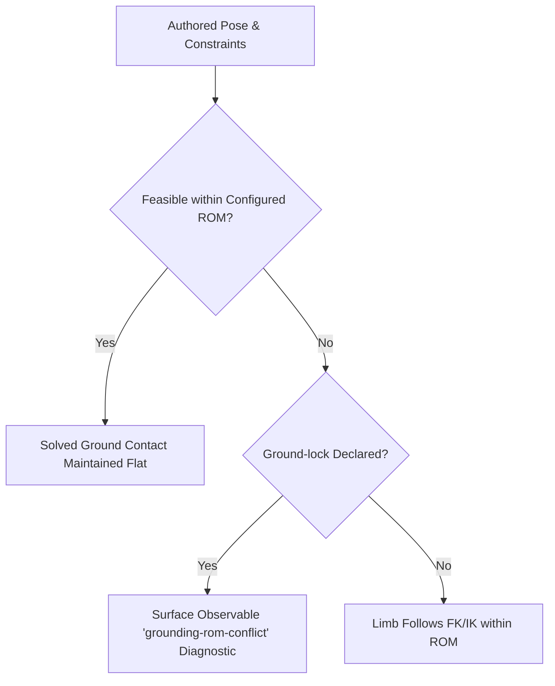

# ROM Profiles and Ground-Contact Invariants (Dancer Mode Analysis)

**Status:** Completed Research & Invariant Specification  
**Date:** October 2026  
**Issue:** [#102](https://github.com/posecode-dev/posecode/issues/102)  
**Tracking:** [#91](https://github.com/posecode-dev/posecode/issues/91) Workstream 3  

---

## 1. Executive Summary

This document addresses the tension between:
1. **Conservative general biomechanical limits** needed to keep general exercise, fitness, and physical therapy safe and physically believable.
2. **Domain-specific dance ranges** (such as classical ballet turnout, deep demi-plié dorsiflexion, and pointe plantarflexion).

We establish the architectural principles, profile options, and deterministically measurable ground-contact invariants that prevent silent foot lift while preserving general safety defaults.

> [!IMPORTANT]
> Range-of-motion ceilings in Posecode are representational thresholds for 3D visualization and kinematic validation. They are derived from sports science and orthopedic literature, but they **do not constitute medical advice or a personalized safety guarantee**.

---

## 2. Biomechanical Literature Review

### 2.1 Hip External Rotation (Turnout)
- **General population / clinical baseline:** Passive hip external rotation averages 35°–45° (Hamilton et al., 1992; American Academy of Orthopaedic Surgeons).
- **Ballet requirements:** A complete 180° first position requires 90° of external rotation per lower limb.
- **Anatomical source:** Multiple studies (e.g., Khan et al., 1995; Negus et al., 2005) show that elite dancers achieve approximately 60°–70° from the femoral head / acetabulum (hip), with the remaining 20°–30° contributed by tibial torsion, subtalar rotation, and forefoot abduction.
- **Current Posecode limit:** `hip: rotate-out` is capped at 45°.
- **Recommendation:** General rig keeps 45°. A `ballet` representation profile or configured rig ceiling of 65° allows authentic hip contribution without fabricating an unnatural 90° purely at the hip joint.

### 2.2 Ankle Dorsiflexion by Context (Weight-Bearing vs. Non-Weight-Bearing)
- **Open-chain (non-weight-bearing):** Measured with knee extended or unweighted, normal range is 12°–18° (current ceiling 15°).
- **Closed-chain (weight-bearing / knee flexed):** In deep squats or demi-plié, sole contact under body weight combined with knee flexion relaxes the gastrocnemius, allowing 25°–35° of functional dorsiflexion (Bennell et al., 1998; Weight-Bearing Lunge Test).
- **Current Demi-plié conflict:** With knees flexed to 55° and a 15° ankle dorsiflexion cap, the shin cannot tilt sufficiently forward while keeping the heel anchored. Geometry dictates that the heel must lift ~2.4 cm off the floor, triggering a `grounding-rom-conflict`.

### 2.3 Plantarflexion (Rise and Pointe)
- **Standard plantigrade limit:** Current Posecode ceiling is 50° (typical daily walking/running).
- **Ballet relevé / pointe:** Ankle-foot complex reaches 90°–100° (tarsal, metatarsophalangeal, and talocrural articulation creating a straight line with the anterior tibial crest).
- **Recommendation:** General movements maintain the conservative 50° ceiling; pointe/tiptoe-specific profiles permit up to 90°.

---

## 3. Profile Architecture Decision

We evaluated three approaches:
1. **Universal loosening:** Raise global hip rotate-out to 70° and ankle dorsiflexion to 30°.
   - *Rejected:* Would allow ordinary fitness exercises (e.g. squats, jumping jacks) to render anatomically distorted or risky postures without warnings.
2. **Sex-based presets (Male/Female):**
   - *Rejected:* Research (e.g., Bennell et al., 2001) shows that joint hypermobility and turnout variance within a cohort far exceed between-sex differences. Explicit domain/rig configuration is significantly more accurate and avoids false assumptions.
3. **Explicit Rig / Domain Profile (`general` vs `ballet`) & Contact Context (Selected):**
   - The default profile remains `general` (conservative 45° hip rotate-out, 15° open-chain dorsiflexion, 50° plantarflexion).
   - Domain-specific rigs or movements declare an explicit profile or rig configuration.
   - When `ground-lock: feet` is declared on a closed-chain movement, the solver accounts for closed-chain ankle compliance while logging measurable contact invariants.

---

## 4. Ground-Contact Invariants and Precedence

When authored joint angles, configured ROM limits, and ground contacts conflict, the system follows this strict precedence:

### Invariant Rules:
1. **Never Silently Lift:** A declared `ground-lock: feet` MUST NOT silently lift the sole from the floor without emitting an explicit, line-anchored diagnostic (`grounding-rom-conflict`).
2. **Measurable Thresholds:**
   - **Heel Height:** $|h_{\text{heel}}| \le 0.005\,\text{m}$ (5 mm) for a flat plantigrade foot.
   - **Toe Height:** $|h_{\text{toe}}| \le 0.005\,\text{m}$.
   - **Sole Tilt Angle:** $\theta_{\text{sole}} \le 12.0^\circ$ relative to the horizontal floor plane.
   - **Foot Drift:** $\Delta(x, z) \le 0.002\,\text{m}$ during phases where the foot is declared locked.

### Diagnostic Classification:
- When a heel rises above 5 mm while the ankle bone is clamped at its dorsiflexion bound, the evaluator emits:
  `{ id: "grounding-rom-conflict:foot_<side>", kind: "grounding-rom-conflict", pass: false }`
- The issue is immediately visible in test suites, CI checks, and the playground warning HUD.
